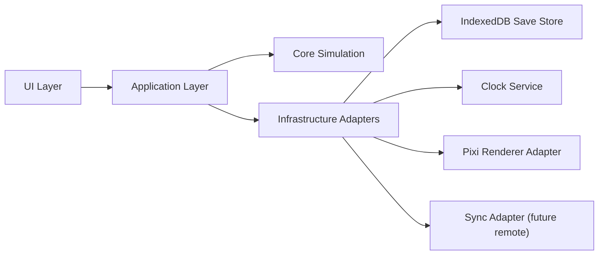

# Architecture - Stage 1

## System shape

The game uses a layered architecture where simulation logic is isolated from storage and UI. The runtime can execute fully local in the browser while exposing interfaces that can later be switched to remote sync for multiplayer.



## Folder structure

```text
medieval-idle-kingdom/
  docs/
    architecture.md
    implementation-plan.md
  src/
    core/
      models/
      contracts/
      simulation/
    application/
      boot/
    infrastructure/
      persistence/
      sync/
    ui/
      view-models/
    styles/
  tests/
```

## Layer responsibilities

- Core
  - deterministic simulation rules
  - data models (economy, population, war, diplomacy, religion, technology)
  - system contracts and tick pipeline
- Application
  - campaign/session orchestration
  - player command dispatch
  - save/autosave scheduling
- Infrastructure
  - IndexedDB repository implementation
  - save envelope validation and schema versioning
  - local event bus and clock adapters
  - local sync adapter (no-op now, replaceable later)
- UI
  - HUD/screen contracts
  - view model mapping from `GameState`
  - map and panel interactions

## Core entities

- `GameState`: global immutable snapshot consumed by systems
- `KingdomState`: one polity with economy, military, diplomacy, religion, administration
- `RegionState`: strategic province with owner, control, unrest, and assimilation
- `WarState`: active conflict data and fronts
- `Treaty`: alliance/non-aggression/vassal/peace contracts
- `DomainEvent`: simulation event stream for logs, alerts, and narrative templates

## Initial data model (seed campaign)

- Campaign: `Mediterranean Ascension`
- Scope: Europe + North Africa + Near East
- Region count in seed: 8 strategic regions
- Kingdom count in seed: 4 kingdoms (`k_player` + 3 NPC powers)
- Victory paths: territorial, diplomatic, economic, religious, dynastic

## Main runtime flow

1. `GameSession.bootstrap` loads current local state (or seed state)
2. `ClockService` emits ticks with delta time
3. `TickPipeline` executes deterministic systems in order
4. `GameStateRepository` persists current state
5. `SaveRepository` rotates autosave slots and exposes restore metadata
6. `UI` projects the latest state through view models

## Tick pipeline intent

Planned system order for Stage 3 implementation:

1. economy and resources
2. population and stability
3. religion and legitimacy
4. technology progress
5. diplomacy decay and treaty checks
6. war resolution
7. NPC decisions and reactions
8. victory and post-victory crisis checks

## Save strategy

- Autosave rotation: 5 slots (`auto-1` to `auto-5`)
- Manual save: 1 slot (`manual-1`)
- Safety save before critical actions: 1 slot (`safety-1`)
- Save envelope includes:
  - schema version
  - created/saved timestamps
  - quick summary for restore UI
  - `GameState` payload
- On load:
  - validate envelope
  - validate minimum `GameState` shape
  - fallback to latest valid slot if corruption is detected

## Multiplayer-ready boundaries

- `GameStateRepository`
- `SaveRepository`
- `INpcDecisionService`
- `DiplomacyResolver`
- `WarResolver`
- `SyncAdapter`
- `EventBus`
- `ClockService`

These ports allow replacing local adapters with networked implementations later without rewriting core simulation.
